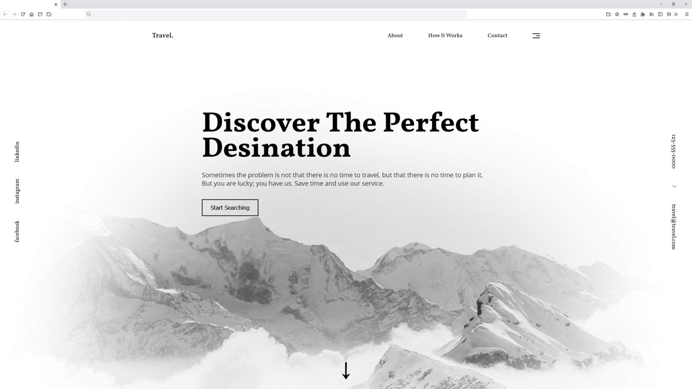
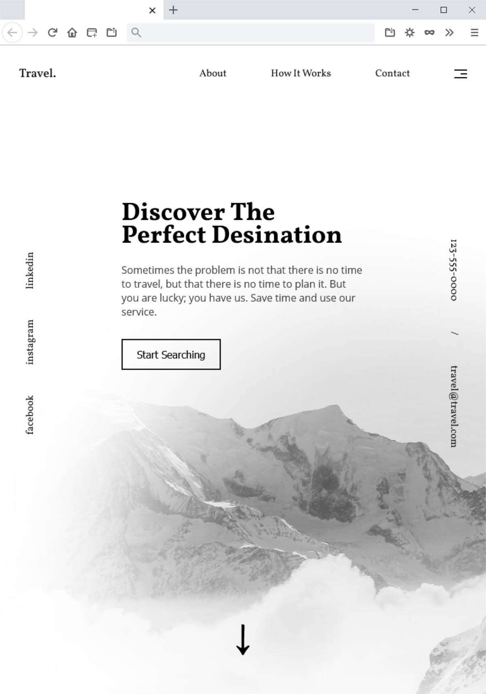

# Travel Agency

This website was designed for a mock travel agency. The goal of this project was to practice bringing a website from design to deployment while leveraging ReactJS. All animations and interactions were created using GSAP. This project has a [demo](https://travel.luis-villa.com/) on my personal website.

Visit my [personal website](https://luis-villa.com) if you'd like to see more of my projects.

## Site

### Landing Page

Minimal landing page draws attention to the websites call to action button.

This is the layout from a tablet-sized device perspective.

## Setup

- This project requires [NodeJS](https://nodejs.org/en/).
- Clone the repository and run `npm i` or `npm install` to download all required modules.
- Once downloaded, run `npm run start`.
- The project should open at [http://localhost:3000](http://localhost:3000).

## Technologies Used

- Frontend
  - react - version 17.0.2,
  - gsap - version 3.6.1,
  - node-sass - version 4.14.1,
